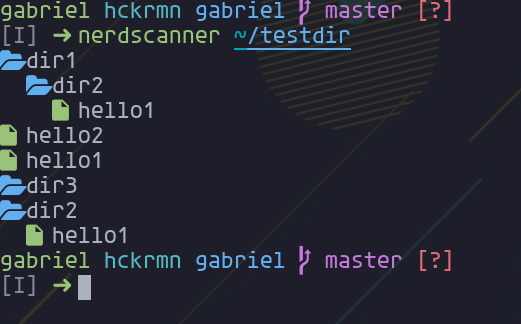
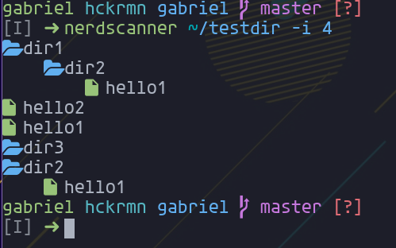
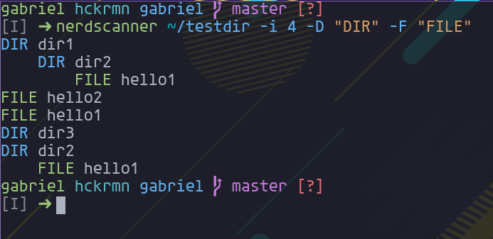
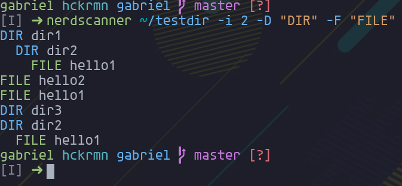

# nerdscanner

Inspired in the traditional tree command for linux. Show a recursive
folder tree with the nerdfonts icons, icons for folders, icons, and
use colors for the output.

## Install

To install use the following commands:

```sh
mkdir ~/repo
cd ~/repo
git clone https://github.com/AlphaTechnolog/nerdscanner.git
cd nerdscanner
./install.sh # Please write your password to create folders in /opt and files in /usr/bin
```

## Uninstall

To uninstall use the `uninstall.sh` script:

```sh
cd $NERDSCANNERPATH
./uninstall.sh
```

## Getting started

First create a testdir

```sh
cd $HOME
mkdir -p testdir/dir1 testdir/dir2 testdir/dir3
touch testdir/hello1 testdir/hello2
ln -s $HOME/testdir/dir2 testdir/dir1/dir2
ln -s $HOME/testdir/hello1 testdir/dir2
```

The output with tree is:

```
/home/gabriel/testdir
├── dir1
│   └── dir2 -> /home/gabriel/testdir/dir2
├── dir2
│   └── hello1 -> /home/gabriel/testdir/hello1
├── dir3
├── hello1
└── hello2
```

The output with nerdscanner:

```sh
nerdscanner $HOME/testdir
```
```
 dir1
   dir2
     hello1
 hello2
 hello1
 dir3
 dir2
   hello1
```

the folder color is blue and the file color is green.

## Options

To custom the output pass the next options:

- `-i/--indent-size`: The indent size
- `-F/--file-icon`: The file icon or prefix
- `-D/--dir-icon`: The directory icon or prefix

Examples:

```sh
nerdscanner $HOME/testdir -i 4 -D "DIR" -F "FILE"
```

```
DIR dir1
    DIR dir2
        FILE hello1
FILE hello2
FILE hello1
DIR dir3
DIR dir2
    FILE hello1
```

## Screenshots


<br>

<br>

<br>

